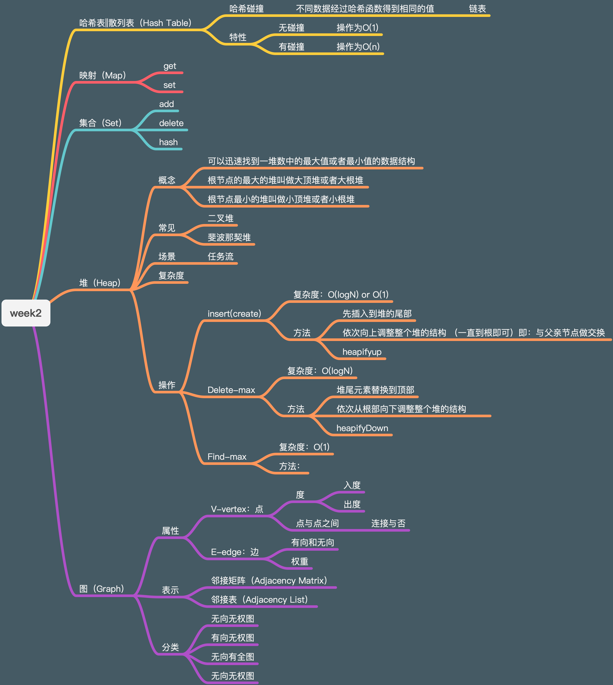

# 学习笔记-Week2
1. 对于树，二叉树，二叉堆，图等数据结构花了比较多的时间了解其特性
2. 上周基本每道题都没有思路，这周的部分题目在读完题后会马上有思路，且有多条思路，部分题目做完后对比完一些高票解答，发现自己的解法与其基本一致
3. 本周参与进了刷题狂魔组，每天完成刷题组作业，并补回了第一周未参与的几天

# 刷题狂魔组刷题打卡  
https://github.com/Zeroi4608/learning-algorithm/blob/main/one-question-per-day/README.md  

知识梳理：
> 