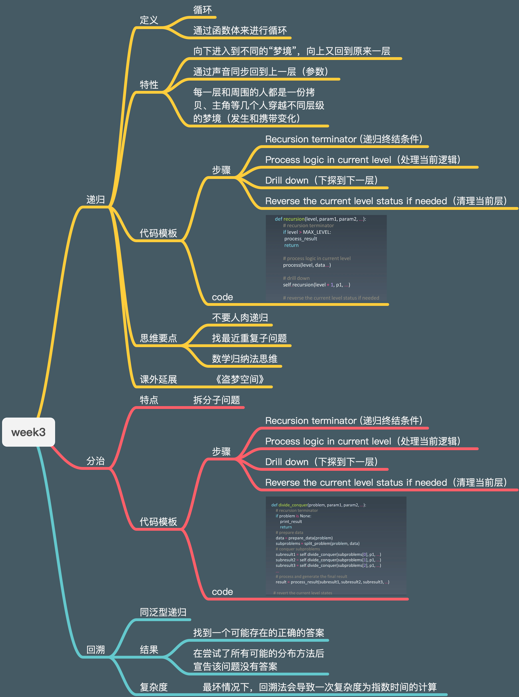

# 学习笔记-Week3
### 本周的主要内容是递归、分治和回溯  
最大的难点：递归过程的感知  
> 我之前最大的误区就是每次写递归脑子里想的是整个链路的过程，一旦有一点中间过程不清晰，就会导致整个思维会特别混乱，然后就只能人肉递归把思路捋顺，这种思考过程是很耗时且收益很低的一种方式。   
> 一个人的思维习惯比较习惯于，顺序的、聚焦的方式。对于递归的场景该聚焦在哪里？答案就是就是每次循环的当前层。如何能做到在聚焦当前层时保证整个链路不会出问题？答案就是以模板的形式来  

最大的收获：递归模板
> 1.终止条件  
2.当前层逻辑  
3.下钻  
4.清理当前层  
虽然本身这只是很小的一个技能或知识点，但是这是足以改变之前递归习惯的利器，是提升递归思考效率一种有效范式。  

我理解的分治和回溯：
> 1.都是特殊的递归，具备递归的一些属性，甚至递归模板也可以通用  
2.分治的特点是当前层的逻辑需要再拆分成不同的子问题，在下钻的时候再合并子问题  
3.回溯的特点在处理问题之前没有一个很具体很标准的答案，需要不断递归来找到第一解或者最优解，当然也可能是无解，本身无解也是答案的一种解。  

本周tips：
> 学习最大的乐趣就是今天比昨天好一点，并且相信明天会更好

知识梳理：
> 

